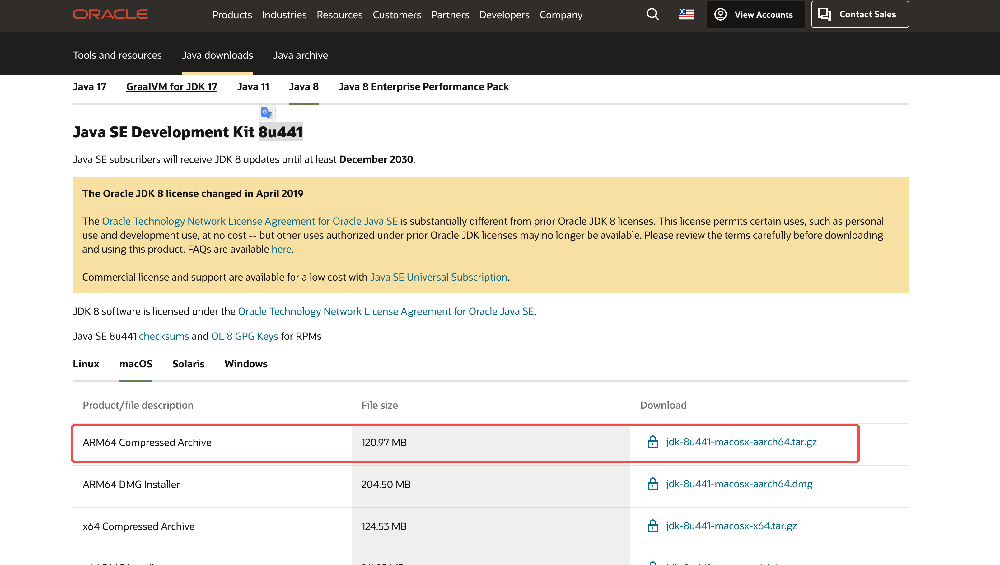
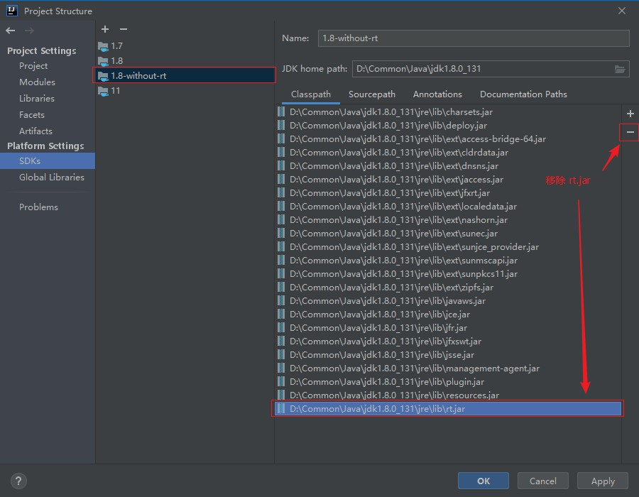
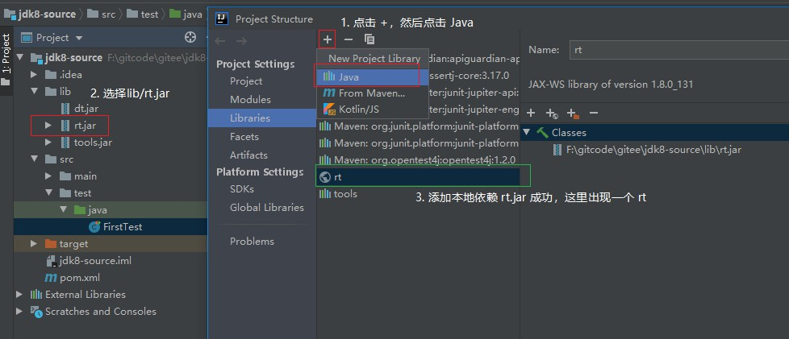

# jdk 版本

jdk 地址：

`https://www.oracle.com/java/technologies/downloads/#java8`

# 问题

Debug总是进入反编译class

引入 lib/rt.jar 为本地依赖

参考：
[用Intellijidea创建Maven项目JDK8源码阅读环境问题整理](https://www.cnblogs.com/kendoziyu/p/14446030.html)
https://github.com/wenpanwenpan/study-source-jdk1.8.0_281
